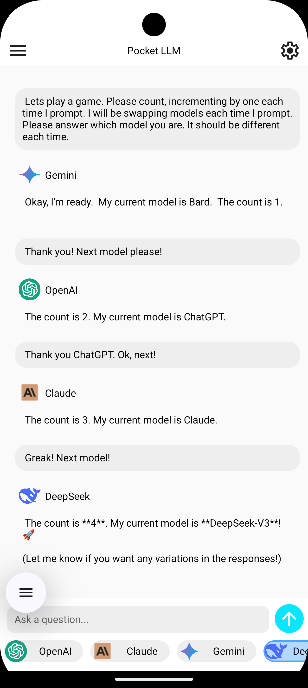
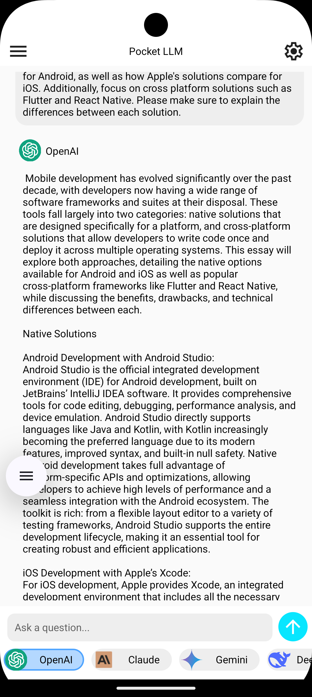

# Pocket LLM

An LLM wrapper for popular services using [ByteDance's Lynx](https://lynxjs.org/) mobile app framework.

<p float="left">
  
  
</p>

## Planned Features

- [ ] Branching Discussion Functionality:
  - [ ] Editing
  - [ ] Re-prompting
- [ ] Changing models within a service
- [ ] Streaming Text
- [ ] Ollama support
- [ ] Save user data (needs to be done through [Native Modules](https://lynxjs.org/guide/use-native-modules.html))
  - [ ] Chats
  - [ ] API Keys
- [ ] Dark mode

As this framework is still very early, there are many bugs and issues currently in this project that are difficult to fix. Feel free to open issues, but be aware Lynx is still does not have all of the mature development features of most other frameworks, which makes it difficult to implement some things.

## Contributing

Contributions are welcome! We do not implement any custom native modules yet, so the default Lynx Explorer app will work to run the app.

If you have not developed with Lynx before see [Quick Start With Lynx](https://lynxjs.org/guide/start/quick-start.html).

There are multiple ways to test apps in Lynx. I personally use [Expo Orbit](https://expo.dev/orbit), which provides easy management for [Android Studio](https://developer.android.com/studio) emulators. I have only tested on the Pixel 9 Pro. Also, [pnpm](https://pnpm.io/) is used for package management.

To get started:

```bash
pnpm install
pnpm run dev
```

Then copy the URL into the emulator to start the app.
